# jev-opus

**Claude Opus 5.5 with the effort level re-decided at every step, without breaking the prompt cache.**

[](https://www.npmjs.com/package/jev-opus) [](https://github.com/WXK-AI/jev-opus/actions/workflows/ci.yml)

```bash
npm install -g jev-opus && jev-opus init && jev-opus claude
```

<p align="center"></p>

jev-opus runs Claude Code on `claude-opus-5-5`, either your normal interactive `claude` with an "Opus 5.5 · Jev" entry in `/model`, or a session it drives itself. The [TypeSafe Jev](https://typesafe.ai) System-1 reflex picks the effort level when a prompt arrives, then again after every tool batch, before Claude's next API call. A failing test raises the next step's effort. Once the same check passes, it steps back down. All of this happens inside one prompt.

A real run in Claude Code 2.1.281, fixing two bugs in a date library (`jev-opus audit` output):

```
D-fda4d1c7 · MEDIUM · 1 attempts (completed) · 808 observed output tokens
  difficulty 1.1/4 → low; debugging floor medium
D-aeab8b84 · MEDIUM → HIGH · 1 attempts (completed) · 381 observed output tokens
  failing checks → recovery effort; diagnosing → +1
D-b73cb943 · HIGH → MEDIUM · 1 attempts (completed) · 175 observed output tokens
  failing check now passes → release hold; verifying → -1
```

## Why the cache survives

Normally, changing `effort` between requests changes the request prefix, which throws away the prompt cache. Opus 5.5 also accepts effort as a **per-message statement** inside the conversation. jev-opus only ever changes effort that way, and it keeps every statement in place on later requests, so the history the model saw never changes. Two modes, same guarantee:

- **`jev-opus claude` (gateway):** your normal Claude Code → local gateway → Jev decides → effort statement inserted before the turn it governs → Anthropic API.
- **`jev-opus "task"` (driver):** runs Claude Code headless via the Agent SDK. After each tool batch, a hook calls `applyFlagSettings({ effortLevel })`, which Claude Code sends as a per-turn statement.

## Install

Requirements:
- Node ≥ 22.18
- [Claude Code](https://code.claude.com) 2.1.280 or newer, logged in (`claude auth login`)
- a Jev key, either a [TypeSafe](https://typesafe.ai) key (`apikey_…`) or an [OpenRouter](https://openrouter.ai/keys) key (`sk-or-…`), which reaches the same Jev model through TypeSafe. Without one, jev-opus still works, using local heuristics.

```bash
npm install -g jev-opus      # or run anything without installing: npx jev-opus …
jev-opus init       # asks for your Jev key and writes ~/.config/jev-opus/.env (the first `jev-opus` run also asks, if you skip this)
jev-opus doctor     # checks Claude Code, your credential, Jev, and a real Opus 5.5 call
```

## Use it in your normal Claude Code: "Opus 5.5 · Jev" in `/model`

```bash
jev-opus claude                 # any `claude` arguments work: jev-opus claude -c, jev-opus claude -p "…"
```

This opens the regular interactive Claude Code, the same interface, tools and approvals. It adds a model entry, **Opus 5.5 · Jev**, and selects it for you. While that model is selected, Jev re-picks the effort before every API call. Pick any other model in `/model` and requests pass through untouched.

### Seeing the effort change

By default (`changes` mode) you see effort in two places:

- **Status line (live).** It shows the current prompt's whole path as it happens, and resets at your next prompt:
  ```
  ◆ Jev · MEDIUM · debugging
  ◆ Jev · medium → HIGH · diagnosing
  ◆ Jev · medium → high → MEDIUM · verifying
  ```
- **Badges above Claude's text.** A badge appears on the first response of each prompt and wherever the level changed, with the reason for the change:
  ```text
  ◆ Jev · MEDIUM → HIGH · failing checks
  ◆ Jev · HIGH → MEDIUM · matching checks passed
  ```

If a change happens on a step where Claude writes no text, Claude Code only allows a notice at the tool call, and it adds the prefix `PreToolUse:Bash says:` itself. Badges show the effort Jev **selected**; they don't measure how much the model actually reasoned.

Display options, set before the command or in `~/.config/jev-opus/.env`:

- `JEV_OPUS_DISPLAY=changes` is the default. `every-response` badges every response, including a notice on every tool-only step. `off` shows no inline annotations (the status line stays).
- `JEV_OPUS_TOOL_NOTICES=0` turns off the tool-call notices.
- `JEV_OPUS_SHOW_DECISION_IDS=1` adds short `D-…` references to badges, matching `jev-opus audit`.
- `JEV_OPUS_NARRATION=1` asks Claude for a short line before each tool call. It adds output tokens, and Opus 5.5 often hides these lines, so it's off by default.
- `JEV_OPUS_NO_INLINE_EFFORT=1` turns off all badges and notices; `JEV_OPUS_NO_STATUSLINE=1` turns off the status line.

[MessageDisplay](https://code.claude.com/docs/en/hooks#messagedisplay) annotations only change the display; they do not enter the stored model conversation. Tool-only responses do not trigger that hook, so native tool notices are the fallback. Display-message UUIDs differ from provider message IDs: audit records explicitly label text annotations as associated with the latest session decision, while tool annotations use the generating tool ID when available. The returned badge is logged; successful rendering or user visibility is not claimed.

**How it works:** `jev-opus claude` starts a small local gateway and points Claude Code at it (`ANTHROPIC_BASE_URL`, an officially supported setup that keeps your claude.ai login). For each request on the Jev model, the gateway asks Jev and inserts a **per-message effort statement** at the turn it governs. It replays every earlier insertion byte-identically on later requests, so the cached prefix and preserved-thinking blocks stay valid. Verified live: effort went medium → low → high → high → low inside one prompt, while cache reads grew on every call (24.5k → 29.9k → 30.0k → 31.4k → 32.3k).

- **Manual changes win.** Running `/effort` yourself pauses Jev until your next prompt.
- **Subagents** are routed as their own threads.
- **Side requests are never routed:** short requests without tools (titles, summaries), and Claude Code's next-prompt suggestion, which reuses the conversation. Their prefix still carries the inserted statements, so they share the cache.

### Other Claude Code surfaces

Start a long-running gateway, then point the surface at it:

```bash
jev-opus gateway                # http://127.0.0.1:47821, prints the env to use; decisions logged to ~/.config/jev-opus/gateway.log
```

The standalone gateway also prints the hook settings for inline badges. Merge those into the client's Claude Code settings while that gateway is running. Restarting the gateway generates a new hook URL; `jev-opus claude` wires this up automatically on each launch.

| Surface | How | Works with a claude.ai subscription? |
| --- | --- | --- |
| Terminal `claude` | `jev-opus claude`, or export the printed env before `claude` | **Yes** (tested) |
| VS Code extension | put the printed env in `claudeCode.environmentVariables` | Yes (same mechanism; not yet tested) |
| JetBrains plugin, Agent SDK apps | set the printed env for the process | Yes (same mechanism; not yet tested) |
| Claude desktop app, Code tab | The app ignores `ANTHROPIC_BASE_URL`. It only uses gateways in its "Claude Desktop on 3P" mode (Developer → Configure Third-Party Inference → Gateway), which replaces your claude.ai account with an **Anthropic API key**. | **No.** Use `jev-opus claude` in the app's terminal panel instead. |
| claude.ai web, mobile, cloud sessions | not routable | No |

`JEV_GATEWAY_DEBUG=1` logs each request's model and message layout (never credentials).

## Or let jev-opus drive the whole session

```bash
jev-opus "fix the failing date tests"            # one prompt in the current directory
jev-opus                                          # its own interactive session: /pin high · /auto · /bounds low medium · /status
jev-opus --route-only "design our billing queue"  # see Jev's decision; no Claude call
jev-opus -v -w ../repo "…"                        # routing reasons, every tool result, per-call effort + cache
```

This mode runs Claude Code headless through the Agent SDK. It switches effort with `applyFlagSettings` from a hook that runs after every tool batch.

| Flag | Default | Meaning |
| --- | --- | --- |
| `--min` / `--max` | `low` / `high` | effort range Jev may use. Pass `--max max` to allow `xhigh` and `max` (`JEV_OPUS_MIN_EFFORT` / `JEV_OPUS_MAX_EFFORT` for every mode) |
| `--effort <level>` | none | pin one level; no routing |
| `--no-jev` | off | local heuristics only |
| `--permission-mode` | `acceptEdits` | anything not auto-allowed is asked for in the terminal; `--yolo` bypasses all prompts |
| `--settings` | `project,local` | Claude Code settings sources to load; add `user` to load `~/.claude/settings.json` |
| `--json` | off | full report: decisions, effort per API call, usage |

Every run writes a JSONL trace to `~/.config/jev-opus/traces/`.

## Claude Code plugin

The repo is also a plugin marketplace. In Claude Code (CLI or desktop app):

```
/plugin marketplace add WXK-AI/jev-opus
/plugin install jev-opus@jev-opus
```

- `/jev-opus:jev <task>` hands the task to a Jev-steered Opus 5.5 run and reports back the result, the effort path and the cache stats. This works inside any chat, desktop app included.
- `/jev-opus:jev-route <task>` shows the effort Jev would pick, and why.

A plugin can't retune the chat it runs in. Claude Code hooks can't set effort, and the desktop app refuses to let a session change its own effort. For that, use `jev-opus claude`.

## How the effort is chosen

One controller (`src/router/`) serves both modes. It estimates the reasoning the **next** step needs from evidence, not from the last tool's name.

**At task start,** Jev classifies the task: its type, difficulty (0 to 4) and stakes. That sets the base level:
- difficulty below 1.25 → `low`, below 2.25 → `medium`, below 3.1 → `high`, above that `xhigh`
- chat and factual questions cap at `medium`
- non-trivial debugging and design work starts at least at `medium`
- high stakes add a level

**During the task,** a reducer tracks evidence across tool calls:
- **Unresolved failures** are tracked by a stable fingerprint. A later pass of the same command or test clears them, even when rerun with recognized output plumbing such as `npm test 2>&1 | tail`. Check identities preserve explicit directories, runner commands, flags, targets, and case; a passing subset or another package cannot clear the original suite. Ambiguous shell commands use conservative command matching. A successful read in between does **not**.
- **Recovery history:** a repeated failure goes one level above the highest effort already tried on it, up to your ceiling, so `max` is reachable when you allow it.
- **Environment blockers** (network, registry, permissions, credentials, missing commands) hold the current effort instead of raising it.
- **Lowering effort** needs positive evidence: no unresolved issues and a clearly routine next step. Without that, it holds.
- **Anti-flapping:** after a raise, the level holds for a step. Bounds are enforced **last**, so tightening them takes effect at once.

**Selective Jev.** Jev is asked at task start, and on a step only when its answer could change the decision: a failure, a proposed downgrade, or unclear local evidence. Other steps are decided locally (`local` in the log). Jev answers are schema-validated: a missing or malformed field keeps the local estimate and never counts as a judgment. Each decision has one 2.5 s deadline (`JEV_DEADLINE_MS`), and a circuit breaker skips Jev during outages.

This is a policy, not a proven optimum. Whether it beats fixed `medium` or `high` on cost at equal quality has to be measured on real tasks; see `docs/architecture-review.md`.

## Transcript integrity (gateway)

Inserted effort statements become part of the history the model has seen, so they must be replayed exactly on every later request:
- **Journal:** every decision is written to an append-only journal in `~/.config/jev-opus/journal/` (owner-only files) **before** the request is forwarded.
- **Eviction and restart:** after a cache eviction or a gateway restart, the conversation is rebuilt from the journal. Verified live: after a restart, a resumed conversation read 32,181 tokens from cache and wrote 75.
- **Retries:** identical concurrent requests share one prepared decision.
- **Edited history:** a request whose earlier content changed is re-routed from the common ancestor.
- **Privacy:** the journal holds hashes, effort levels and usage numbers, never prompts, tool output or credentials. Usage and stop reason are recorded separately for each request attempt. Decisions also carry routing reasons, source, policy versions, bounds, and evaluator timing.

**Accounting.** Driver-mode task costs are differences between Claude Code's cumulative session totals, subagents included. Per-call output tokens in driver mode are the SDK's streamed values and can undercount. Use task totals, or the gateway audit export for observed per-attempt usage. Missing final usage is marked incomplete; it is never silently treated as zero. Legacy journals lack exact retry attribution.

## Audit history

```bash
jev-opus audit                     # list decisions, attempts, and observed output usage
jev-opus audit D-a3e014f2           # inspect a reference from audit output or debug badges
jev-opus audit D-a3e014f2 --json    # export matching decisions and raw events
jev-opus audit --json              # export all gateway journals
```

The owner-only JSONL files in `~/.config/jev-opus/journal/` are the durable source. A decision ID is created before its trace/display metadata; each actual upstream dispatch gets a distinct attempt ID, including retries of a shared decision. Attempt usage is aggregated once per attempt. Exports retain separate timestamps, provider IDs when available, and visual annotations without assistant text. Old records remain readable and are explicitly marked as legacy where attribution is unavailable.

A response is completed only after protocol completion. In-stream errors are failed; streams ending without completion are unknown. Usage coverage is tracked separately. Very large non-streaming JSON bodies that exceed the telemetry parser's 1 MiB bound are forwarded unchanged but marked unknown; streamed content is parsed incrementally.

The prepared decision, which holds the statements the request needs, is flushed to disk before forwarding. If that write fails, the request is not sent. Later records (dispatch, completion, annotations) are telemetry: if they fail to write, a visible degraded-logging notice appears, and they never block a request.

A partial last line, which a crash during a write can leave, is skipped when the journal is read. Corruption anywhere else stops replay for that conversation with an explicit error, rather than silently inventing replacement history. Keep the JSONL files intact when exporting or backing them up.

## Credentials and isolation

The Claude Code child process never inherits a parent session's `ANTHROPIC_*` / `CLAUDE_*` variables. That matters when jev-opus is launched from inside Claude Code: without this, it would reuse the parent's token and its pinned `CLAUDE_CODE_EFFORT_LEVEL`. The child gets only:
- a `JEV_OPUS_ANTHROPIC_API_KEY` / `JEV_OPUS_CLAUDE_OAUTH_TOKEN` variable, or
- an `ANTHROPIC_API_KEY` / `CLAUDE_CODE_OAUTH_TOKEN` written in a jev-opus `.env` file, or
- your `claude` login.

A plain `ANTHROPIC_API_KEY` inherited from the launching environment is **not** used unless you set `JEV_OPUS_INHERIT_CREDENTIALS=1`. `jev-opus doctor` shows which source was picked.

The child also skips `~/.claude/settings.json` by default, so a proxy configured there can't redirect it, and your claude.ai connectors aren't loaded.

## Library

```ts
import { JevOpusSession, EffortRouter, JevClient, childEnv } from 'jev-opus';

const router = new EffortRouter({ jev: new JevClient(), bounds: { min: 'low', max: 'high' } });
const session = new JevOpusSession({
  router, cwd: process.cwd(), model: 'claude-opus-5-5', env: childEnv().env,
  permissionMode: 'acceptEdits', settingSources: ['project', 'local'],
});
const report = await session.send('fix the failing tests');
console.log(report.callEfforts, report.usage);
await session.close();
```

## Development

```bash
git clone https://github.com/WXK-AI/jev-opus && cd jev-opus && npm install
node src/cli.ts doctor      # runs the TypeScript directly (Node ≥ 22.18)
npm test                    # offline tests, including a scripted fake Claude Code that fires the real hooks
npm run typecheck && npm run build
npm run validate:plugin     # needs the claude CLI
```

Releasing:
1. Bump `version` in `package.json` and `plugin/.claude-plugin/plugin.json`, run `npm run build`, then commit and push.
2. Run `npm publish --access public`; npm asks for two-factor approval in the browser.
3. Push a matching tag once npm shows the version: `git tag v0.4.1 && git push origin v0.4.1`.

The release workflow runs the tests, skips publishing when the version is already on npm, and creates the GitHub release. With npm trusted publishing configured for `release.yml`, step 2 can be dropped: the workflow then publishes itself, with provenance.

Inspired by [miuuyy/Astra-Ares](https://github.com/miuuyy/Astra-Ares), which brings Jev-chosen reasoning effort to Codex through a patched Codex build. jev-opus gets the same model-picker experience in Claude Code without patching it, through the supported gateway setup.

MIT © WXK-AI. Not affiliated with Anthropic, TypeSafe, or Astra-Ares.
