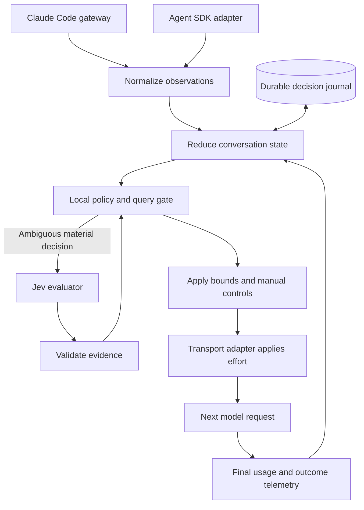

# Adaptive effort architecture review

Reviewed 2026-09-24 at commit `b525d4c` (v0.3.0).

The project has a useful integration and a plausible routing hypothesis. Keep the Claude Code integration, per-message effort transport, deterministic fallback, and explicit manual controls. Redesign the controller state and measurement before investing in more elaborate routing rules.

The intended objective should be **lower total task cost and latency at an acceptable level of task quality**. Changing effort frequently, reducing individual response tokens, and obtaining a high cache-read percentage are intermediate measurements, not proof of improvement.

This is a review and implementation proposal. At the time of the initial review, production code was unchanged and all 35 existing tests, typechecking, and the build passed. Additional local reproductions used fake HTTP services and a scripted SDK; no paid model evaluation was run. A subsequent user-requested visibility change is described below; the proposed controller redesign remains separate work.

## What is sound

- The request boundary is a useful place to choose effort: after tool results arrive and before the next model generation.
- Reusing Claude Code preserves its tools, permissions, user interface, and existing integrations.
- Policy functions are already separated from model calls and are straightforward to exercise offline.
- A small external evaluator can potentially identify cases where changing effort is worthwhile.
- Manual overrides, bounds, and fallback behavior are appropriate controls.

The underlying transport is supported: Anthropic documents per-message effort for Opus 5.5, with an effort-only system message and the appropriate beta header. This permits effort changes without changing the preceding conversation prefix. Native adaptive thinking already varies reasoning within a request; external routing must demonstrate additional value. Effort also affects tool use and other output, so lowering it can change the task trajectory. [Anthropic effort documentation](https://platform.claude.com/docs/en/build-with-claude/effort).

## Findings to fix first

### 1. P1: concurrent requests can bypass the pending decision

Location: `src/gateway/server.ts:168-169`, followed by the awaits at `193` and `199`.

`decidedAt` is advanced before Jev finishes. An overlapping identical request is then classified as a retry and forwarded before the first request's insertion exists.

Reproduction: hold the first Jev response with a deferred promise, send an identical second request, then release Jev. The second request reaches upstream at top-level `medium`; the original arrives later with an inserted `high` statement.

Fix: use a per-branch queue and a single-flight decision keyed by a complete request fingerprint. Publish the immutable prepared transformation only when the decision and its journal entry are ready. Duplicate routing must await that result. This does not by itself provide exactly-once upstream execution or billing.

### 2. P1: the cache-preserving transcript depends on disposable memory

Location: `src/gateway/server.ts:228-234`.

Gateway insertions exist only in the `Thread` object. Eviction or restart removes statements the upstream model previously saw, because Claude Code never received those statements back into its own transcript.

Reproduction: configure `maxThreads: 1`, route session A, route session B, then continue A. A's original effort statement disappears; a new statement appears near the current turn instead.

The disappearing statement is verified locally. A real provider's response to this particular fixture was not tested. Anthropic documents that modifying earlier system messages invalidates the later cached prefix and, on Opus 5.5, later preserved thinking. [Mid-conversation system messages](https://platform.claude.com/docs/en/build-with-claude/mid-conversation-system-messages).

Fix: persist the transformation journal independently of the in-memory controller cache. Reload it on resume. If a journal for a transformed conversation cannot be recovered, require a clean continuation through a supported client mechanism; do not silently pretend raw history is equivalent.

### 3. P1: accounting cannot currently validate the optimization

Locations: `src/claude/session.ts:245-262`, result handling in that file, and `src/cli.ts` passing `jev.costUsd` to the per-task report.

The driver records usage from the first assistant block for each message ID and ignores later usage for that ID. The installed SDK explicitly describes these assistant messages as block-level events with non-final usage. Final accounting is available on result events.

The SDK also documents `total_cost_usd` and `modelUsage` as cumulative for a streaming-input session. The report labels cumulative cost as task cost, while resetting task token counters. Jev cost is likewise cumulative. Subagent usage is omitted from the driver's token counters.

Reproduction: a scripted message reports zero output tokens in the first block and 100 in later/final usage. The task report retains zero. Two task results carrying cumulative costs of $0.10 and $0.30 are reported as task costs of $0.10 and $0.30, although the second increment is $0.20.

Fix: take session counter snapshots and calculate task deltas, handling reset and resume epochs. Use final `modelUsage` for pipeline-wide accounting and label coverage. Observe actual request/response usage for per-call attribution. Keep requested, applied, and observed effort distinct; do not label a locally requested level as confirmed execution.

Installed contract references: `node_modules/@anthropic-ai/claude-agent-sdk/sdk.d.ts`, declarations of `SDKAssistantMessage`, `SDKResultSuccess`, and `SDKResultError`.

### 4. P2: changed history can be mistaken for an identical retry

Location: `src/gateway/server.ts:160-169`.

Retry detection is based on the last user-message index. Insertion validation hashes only the prefix *before* the insertion, so it need not notice changed content in the result being governed.

Reproduction: route a successful tool result at low effort, replace that result with a failure at the same message index, and resend. No new Jev call occurs; the low statement remains.

Fix: separate request identity, branch ancestry, and insertion placement. A boundary fingerprint must include the actual user/tool-result payload and relevant configuration. Rewind must restore controller state at the common ancestor, including hysteresis and unresolved issues, rather than retaining state from an abandoned branch.

### 5. P2: malformed Jev responses can silently weaken a decision

Locations: `src/jev/client.ts:49-66`, `JevClient.ask`, and profile construction in `src/router/router.ts`.

Missing answers are replaced with neutral answers, while an HTTP 200 response is classified as successful. An invalid choice is replaced by the first category, potentially retaining high confidence. Difficulty confidence is parsed but discarded by the router.

Reproduction: serve HTTP 200 with `{}` for a production security architecture and billing migration request. The router reports a Jev profile of `chat`, difficulty 2, stakes 0.5, and medium effort. The deterministic profile for the same request is architecture, difficulty 3.895, stakes 1. Missing evidence displaced the fallback instead of triggering it.

Fix: validate the response schema and mark each signal as valid, missing, invalid, or unavailable. Preserve the local estimate for missing fields. Reject unknown choices instead of manufacturing a category. Retain uncertainty; a classifier confidence is not automatically a calibrated probability of task success.

### 6. P2: hysteresis can violate the configured effort ceiling

Location: `src/router/router.ts:110-115`.

The target is clamped before hysteresis, but the returned effort is not. Tightening bounds while current effort is high can leave the result above the new ceiling.

Reproduction: current effort `high`, new bounds `low..low`, a routine read: the returned effort is `medium`.

Fix: validate `min <= max`, reconcile current effort with the new legal range, and enforce constraints after all policy transformations. Define manual-pin precedence explicitly. An organizational or model capability ceiling remains authoritative.

### 7. P2: repeated failure remains anchored to the original estimate

Location: `src/router/policy.ts:91-103`.

Escalation adds levels relative to the initial task effort, not the currently attempted level. Raising the cap to `max` does not raise the target to it.

Reproduction: a task initially rated low, next-step difficulty 4, stuck score 1, ten consecutive failures, and an allowed maximum of `max` still produces `high`. Repeating this observation cannot advance beyond high. Also, successful intervening reads reset the consecutive-failure counter even when the same failing test remains unresolved.

Fix: track unresolved failure identities, attempted effort levels, progress, and outcomes. Revise the task estimate when evidence contradicts it. Escalate further only for reasoning problems with plausible benefit; repeated unavailable credentials or missing infrastructure should not cause an unlimited reasoning escalation.

### 8. P2: credential isolation differs from the documented behavior

Locations: `src/config.ts` credential loading and `src/claude/env.ts`.

`childEnv` strips parent Anthropic variables, but `config.claudeCredentials` has already captured the same process environment. It can immediately reintroduce a parent key, labelled as coming from the jev-opus config.

Reproduction: set a synthetic parent `ANTHROPIC_API_KEY` and leave the dedicated override empty; the child receives the synthetic key again.

Fix: retain configuration provenance. Separate explicit jev-opus credentials, configuration-file credentials, and inherited variables. Define the allowed inheritance policy instead of claiming to distinguish origins after they have been merged.

## Why the current effort policy needs redesign

The heuristic often predicts the next computation from the previous tool's name. A successful `Read` does not mean the next generation is easy: it may need to understand a subtle synchronization bug or design an implementation spanning several files. Conversely, a failed shell command may need only a path correction.

The phase labels are useful context, but should not directly mean “exploring = cheaper” or “verifying = cheaper.” Test selection, interpreting results, checking coverage, and making a final correctness judgment can require substantial reasoning. A short final answer can summarize a difficult unresolved decision.

The controller also lacks a measured relationship between its difficulty score and the *benefit of additional effort*. Thresholds such as 1.25 and 2.25 are policy assumptions. Passing tests of those thresholds proves consistent implementation, not useful routing.

Jev runs on every decision boundary. With the present 8-second timeout, one retry, and 300 ms backoff, a timeout path can add roughly 16.3 seconds before each Claude request. No circuit breaker prevents repeating this throughout an outage. Router latency and provider retries must be included in total task latency and cost.

## Recommended architecture

Keep one TypeScript application with a small shared controller and two transport adapters. A distributed service or a new multi-agent runtime is unnecessary for this scope.



The Jev response returns through validation once per evaluation attempt; the query gate must not recursively request another evaluation for the same boundary.

Suggested modules:

```text
src/core/events.ts             Normalized observations and decision records
src/core/reducer.ts            Pure state transitions, branch-aware snapshots
src/core/controller.ts         One decision path shared by both adapters
src/core/policy.ts             Baseline, escalation, de-escalation, query gating
src/core/constraints.ts        Manual controls, bounds, capability checks
src/evaluators/jev.ts          Deadline, schema validation, circuit breaker
src/evaluators/local.ts        Deterministic evidence extraction
src/state/journal.ts           Persisted prepared transformations and state
src/adapters/gateway.ts        HTTP/SSE forwarding and transcript transformations
src/adapters/claude-sdk.ts     SDK hooks, settings application, event normalization
src/telemetry/usage.ts         Final counters, deltas, scope and coverage
evals/                        Replay fixtures and end-to-end task evaluation
```

Both adapters call the same reducer and controller. Each conversation uses one actuator: an SDK session must not also be independently routed by the gateway. Keep transport-specific history transformations outside the policy.

### State and contracts

Track these separately:

| State | Purpose |
| --- | --- |
| Conversation and branch identity | Distinguish session, agent, provider/account scope, model/configuration epoch, and lineage |
| Task prior | Initial complexity, consequence of mistakes, and known requirements; revisable with evidence |
| Pending reasoning | What must be interpreted or decided in the upcoming model generation |
| Unresolved issues | Stable error fingerprints, attempted fixes, and evidence of resolution |
| Progress | Test outcomes tied to code versions, changed artifacts, new evidence, repeated actions |
| Effort control | Requested/applied/observed levels, manual override scope, bounds, recovery stage |
| Resource state | Task/session usage, deadlines, remaining authorized budget, evaluator overhead |
| Decision provenance | Policy/question-set versions, model version, feature schema, evidence validity, fallback reason |

Store a compact rolling state. Do not send the full transcript to the evaluator. Include the latest meaningful goal, structured outcomes, representative error excerpts, change scope, and relevant unresolved issues. Preserve provenance and treat file/tool text as untrusted evidence. Raw source snippets should be optional; external evaluation currently sends excerpts of prompts and tool output to the configured Jev provider and should be clearly disclosed.

Example decision record, as a contract sketch:

```ts
interface DecisionRecord {
  decisionId: string;
  conversationId: string;
  branchId: string;
  requestFingerprint: string;
  policyVersion: string;
  evaluatorVersion?: string;
  requestedEffort: Effort;
  appliedEffort?: Effort;
  observedEffort?: Effort;
  source: 'manual' | 'local' | 'jev' | 'fallback';
  reasons: string[];
  evaluatorLatencyMs: number;
  status: 'prepared' | 'sent' | 'completed' | 'failed' | 'unknown';
}
```

### Decision policy

Start with an interpretable policy; introduce learned predictions only when evaluation data supports them.

1. Apply the explicit manual mode, model capabilities, and authorized bounds.
2. Reduce new evidence into state. Keep unresolved issues across unrelated successful calls.
3. Use a conservative baseline for unfamiliar coding work. Medium is a reasonable Opus 5.5 candidate to evaluate, not a proven universal optimum.
4. Escalate when a correctness failure, contradictory evidence, difficult pending decision, or repeated unsuccessful repair indicates that more reasoning could help.
5. De-escalate only on positive evidence that the next decision is routine and important unresolved issues are absent. Require stronger evidence to lower effort than to retain it.
6. Consult Jev only when uncertainty could materially change the selected level. Task start, a surprising outcome, stalled recovery, or a proposed downgrade are useful candidate triggers.
7. Use bounded hysteresis and enforce the legal range again after it.
8. Prepare and persist the decision, apply it once for that boundary, and record the result.

Ask Jev about pending reasoning demand, unresolved ambiguity, likely benefit from extra reasoning, and whether apparent failure is an environment issue. Phase can remain an explanatory feature. Returned scores remain estimates until calibrated against actual outcomes.

Do not assume `low < medium < high` always translates into increasing task quality or decreasing completion time. Higher effort may reduce retries, increase exploration, or overcomplicate easy work. Evaluate complete trajectories.

Once enough evidence exists, the longer-term objective can be written as:

```text
minimize expected remaining task cost + latency weight × expected remaining time
subject to quality remaining within an accepted margin of the reference policy
and respecting explicit bounds, capabilities, and resource limits
```

The controller should estimate the marginal benefit of a change, including its own evaluation cost. The task-quality constraint cannot be implemented by relabelling an uncalibrated Jev score as a success probability.

### Example behavior

| Observation | Proposed behavior |
| --- | --- |
| Routine rename, small known scope | Allow low after sufficient evidence |
| Read several files to understand an unfamiliar race | Retain medium/high because interpretation remains unresolved |
| New reproducible assertion failure after an edit | Raise effort for diagnosis and track the failure identity |
| Successful file read between attempts | Keep the unresolved failure; do not reset recovery |
| Same test fails after a different attempted fix | Reassess the approach and current effort; allow further escalation within bounds |
| Dependency registry is unavailable | Classify environment blocker; avoid escalating simply because it repeats |
| Relevant checks pass against the latest changes | Consider a lower effort after assessing remaining requirements |
| Final answer still requires architectural synthesis | Retain the level needed for that reasoning despite the “finishing” phase |

### Evaluator reliability

Make the evaluator optional on every path. Use an overall deadline, cancellation connected to the client request, schema validation, and a circuit breaker. Avoid serial retries in the critical request path by default.

A total evaluator deadline around 500 ms is an initial experiment, not a measured SLA. Tune it from observed latency and benefit. If the evaluator regularly misses it, use local decisions or a different budget; do not imply a timed-out remote decision was applied. Ignore late results for already-dispatched requests.

During outages or invalid responses, retain the current/baseline level unless local evidence justifies a change. Missing evaluation evidence should not itself trigger a downgrade. Run any recovery probe on subsequent real traffic, not through a frequent model-driven monitoring loop.

### Transcript integrity

Use an append-only journal, backed by SQLite or a carefully synchronized durable log, containing decision IDs, branch ancestry, controller snapshots, and exact inserted statements. Raw source text and credentials need not be retained for this purpose.

For each boundary:

1. Establish conversation scope and branch lineage; do not use only the first message and user index as identity.
2. Serialize decisions within a branch and share a pending decision for an identical fingerprint.
3. Restore the common-ancestor state after rewinds. Treat compaction as a new explicit epoch while preserving recoverable task state.
4. Prepare and durably record the transformation before forwarding it.
5. Replay the same prepared transformation for a retry. Treat changed tool results or configuration as a new request.
6. Mark upstream status separately. A disconnection can leave acceptance unknown; do not delete the journal and reconstruct a different request.

Keep original thinking/signature blocks opaque. Normalize only known transport metadata for identity comparisons; do not recursively erase arbitrary keys named `cache_control` from tool arguments. Separate comparison fingerprints from actual outgoing bytes.

Retain active journals when evicting the in-memory working set. Use owner-only file permissions and an explicit retention/recovery policy. Missing history is a state-recovery problem, not a reason to silently remove previously transmitted statements.

Version and test the adapter against real Claude Code request shapes, including trailing client effort statements, manual overrides, subagents, compaction, retries, and server-tool continuations. The current before-and-after insertion workaround needs provider compatibility fixtures; the local helper is not independent proof of the provider's effort precedence.

### Measurement

In gateway mode, parse a bounded copy of relevant SSE events while preserving stream bytes and backpressure. Associate final usage and stop reasons with prepared decision IDs. Record transport errors, interrupted streams, and retries without interpreting them as successful task completions.

In SDK mode, derive task costs from cumulative result deltas and use final usage with clearly labelled scope. Per-call observations can be incomplete, especially for helper calls; expose that limitation instead of presenting inferred numbers as exact. Hook-observed effort should corroborate the application record where available.

Record evaluator spend, uncached input, cache reads/writes, output, latency, outcome, model/version, SDK/CLI version, and policy version. Existing question-set version constants should actually be included in decision provenance. Gateway response telemetry is required before claiming gateway-level savings. Cache diagnostics can help investigate unexplained misses. [Anthropic cache diagnostics](https://platform.claude.com/docs/en/build-with-claude/cache-diagnostics).

## Inline visibility requirement and implementation

The user selected visual badges in the live Claude chat, with the model conversation preserved. Every assistant text message should display the selected effort and phase; the first badge after a change should show the previous-to-current transition. Tool-only responses need a native notice, and manual overrides must be identified explicitly.

The follow-up implementation uses local HTTP `MessageDisplay` and `PreToolUse` hooks. Display deltas receive a prefix only at index zero; later deltas stay unchanged. A small session/agent-scoped UI state prevents duplicate tool notices and is cleared when an eligible request switches away from the Jev model. The launcher merges these session hooks with explicit caller settings and preserves an existing custom status line. No extra evaluator call or assistant-response rewrite is needed.

These are live annotations. They are not inserted into the model transcript or regenerated for old messages on resume/export. Their label represents the selected effort; independently observed provider effort remains a separate telemetry requirement. Claude Code documents this display-only boundary for `MessageDisplay`. [Hook reference](https://code.claude.com/docs/en/hooks#messagedisplay).

Validation includes the installed Claude Code 2.1.280 CLI connected only to a local fake model service: a normal text response received a badge, and a tool-only response followed by a failure received a notice and a LOW → HIGH badge. The model request history contained no badge text. Further controller work should bind visibility to durable request IDs as described above, so attribution remains reliable through concurrent requests and branch recovery.

## Alternatives

| Approach | When it is attractive | Tradeoff |
| --- | --- | --- |
| Fixed medium or high with native adaptive thinking | Baseline; potentially the best default if routing adds little | Cannot deliberately change per-request effort |
| Initial task routing plus local escalation | Low complexity and low recurring latency | Less sensitive to ambiguous changes in reasoning demand |
| Shared controller with selective Jev evaluation | Recommended development direction | Needs reliable state and actual outcome evaluation |
| Jev before every generation | Useful experimental comparison | Serial latency and unnecessary evaluation on obvious boundaries |
| Model chooses its next effort through a structured control tool | Possible research experiment | Self-assessment can be wrong; control needs an extra boundary and cannot retroactively improve the generation making the choice |
| Own Messages API agent loop | Maximum control over transport, checkpoints, tools, and experiments | Rebuilds permissions, tool execution, compaction, UI, and other Claude Code capabilities |
| Specialist model or agent delegation | Independent, well-scoped work | Handoff/context overhead; a separate optimization from effort routing |

The direct Messages API option can additionally experiment with advisory task budgets. Current Anthropic documentation says these are not supported on Claude Code/Cowork surfaces. They are not hard spend limits, and changing their request-level values affects caching. They therefore should not be presented as a drop-in feature of the current Claude Code gateway. [Task budgets](https://platform.claude.com/docs/en/build-with-claude/task-budgets).

## Evaluation and rollout

First repair correctness and establish trusted accounting. Then compare fixed low/medium/high, task-only routing, deterministic escalation, current per-batch Jev routing, and selective Jev routing on the same representative tasks. Include xhigh/max where capability or allowed bounds make them relevant.

Use independent clean repository snapshots, fixed model/tool configurations, repeated trials, and a held-out task set. Include easy edits, multi-file features, subtle bugs, architectural work, environment failures, and long recovery sequences. A small pilot can find large failures; a tight quality margin requires a sample-size decision based on observed variance, not a handful of demos.

Evaluate correctness with acceptance criteria or tests that the agent cannot redefine, plus review where tests are insufficient. Report completion rate, regressions, total dollars, end-to-end p50/p95 latency, and dollars per successful task. Include failures and retries in the denominator and total spend. Prefer quality/cost/latency comparisons over a single token-savings percentage.

Transcript replay is useful for state correctness and policy comparison on observed inputs. Shadow decisions are useful for overhead and disagreement measurements. Neither proves counterfactual quality or savings: different effort changes later actions and observations. Real task rollouts are necessary.

Implement in this order:

1. **Reliable control:** fix the reproduced defects; add regression fixtures for concurrency, changed history, eviction/restart, malformed evidence, bounds, usage finalization, and credential provenance. Add failed/disconnected SSE and manual override cases.
2. **One shared core:** introduce normalized events, a pure reducer, a durable journal, and thin gateway/SDK adapters. Preserve public commands during migration.
3. **Selective adaptation:** introduce progress-based recovery, uncertainty-aware downgrade rules, evaluator deadlines, and a circuit breaker. Run the new policy in shadow mode first.
4. **Measured rollout:** perform controlled task comparisons and enable the adaptive default only for task classes where the quality and resource tradeoff is supported. Retain a fixed-effort mode and rollback path.
5. **Learned calibration:** only after trustworthy outcomes accumulate, fit and validate predictors of effort benefit. Avoid unvalidated online exploration in real user repositories.

Additional maintenance work: ensure `--json` produces clean machine-readable output; validate CLI enum/numeric values; bound request bodies and in-memory telemetry; handle stream errors and startup/shutdown failures; test capability support instead of accepting every `jev/` model alias; document which data reaches Jev and what gateway/driver accounting covers. These should follow the core reliability work rather than expanding the initial rewrite.

The implementation succeeds when effort decisions are applied predictably, history survives realistic session lifecycles, and controlled evaluations show a better quality/cost/latency tradeoff. Until then, the project demonstrates dynamic effort control, not an established optimal effort policy.
