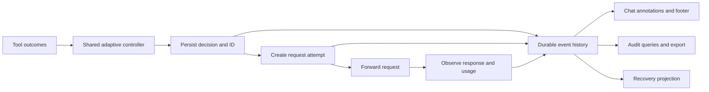

# Effort visibility and auditing review

Reviewed 2026-09-24 against `707ad60` / v0.4.0, including the supplied Claude Code 2.1.281 session. This is the original review and design rationale. Implementation follow-up: scoped check identities, per-attempt journal accounting, protocol-aware completion, shared decision references, visual annotations, default tool notices, and the `jev-opus audit` export are now implemented. The custom renderer and comparative policy benchmarks remain future work.

The shared controller, evidence reducer, selective Jev evaluation, replay journal, and visual-only hooks are a sound foundation. Keep them. The next architectural improvement is one durable event history that connects decisions, request attempts, outcomes, and visual annotations. A complete rewrite of the router is unnecessary.

## What the supplied session demonstrates

The initial assistant text is marked MEDIUM. The next response contains only a Bash call, so its MEDIUM → HIGH notice appears inside the tool presentation. The final assistant text shows MEDIUM → HIGH → MEDIUM. This records a path, but does not clearly identify which response used which requested setting. The final `implementing` label is a phase estimate, not evidence of what that response actually did.

Keep visual metadata outside the model's conversation, as requested. Narration is a separate behavior preference and should stay off by default. It adds generated text and cannot guarantee the placement or existence of a badge.

Claude Code's [MessageDisplay documentation](https://code.claude.com/docs/en/hooks#messagedisplay) establishes two important constraints: the hook only handles assistant text, and its display message UUID differs from the API message ID. Tool-only responses need another display channel. Do not assume those two IDs can be joined directly.

## Verified gaps

All 113 existing tests and TypeScript checking passed. Additional local reproductions used synthetic inputs, a loopback HTTP server, and no paid model calls.

| Priority | Finding | Evidence and consequence |
| --- | --- | --- |
| P1 | A different test suite can clear an unresolved failure. | `cd api && npm test` failed; then `cd web && npm test` passed. The reducer changed from one open issue to zero and reported `resolved`. `coreCommand()` removes the directory and `testRunner()` reduces both suites to `npm test`. This can release the escalation hold before the failing suite has recovered. See `src/router/state.ts` and `src/claude/describe.ts`. |
| P1 | A failed or incomplete API stream can be recorded as completed. | Both an HTTP 200 stream containing `event: error` and an HTTP 200 stream ending without `message_stop` produced journal status `completed`. `attachTelemetry()` tests transport EOF and HTTP status, not protocol completion. See `src/gateway/server.ts:244`. |
| P2 | Request attempts share one decision's mutable accounting projection. | Two identical requests made two upstream calls, returning 10 and 20 output tokens. The raw journal retained both completion events, but `Journal.records()` returned one decision with only 20 output tokens. There is no attempt ID to distinguish concurrent attempts. See `src/gateway/journal.ts:109`. |
| P2 | Display, decision trace, and journal lack a common identity. | `gateway_decision` is emitted before `journalRecord()` creates its decision ID. Display state retains only the latest session/agent decision. Hook outputs are not journaled. An auditor cannot reliably join a displayed annotation to a particular request attempt. See `src/gateway/server.ts:412` and `src/gateway/display.ts:44`. |

The streaming behavior above is a real protocol concern: Anthropic documents [in-stream errors and the terminal message_stop event](https://platform.claude.com/docs/en/build-with-claude/streaming#event-types). A successful HTTP status alone is insufficient.

Other auditing limitations found by inspection:

- The durable decision record omits the decision's reasons, step signals, evaluator latency/error, and explicit source. Those are useful for explaining why effort changed. A router snapshot is recovery state, not a complete explanation.
- Manual overrides do not follow the same decision trace callback path as automatic decisions.
- The journal reader overwrites the decision timestamp with the latest update timestamp. Raw lines preserve the earlier time, but the folded record cannot expose separate decision, dispatch, and completion times.
- Journal write errors become notices while requests continue; trace write errors are silently ignored. The product should expose degraded audit coverage rather than imply a complete history.
- The journal has restrictive permissions and excludes prompt text. The debug path separately logs a prefix of the last message's content, and ordinary trace/log files do not explicitly enforce the same permissions. Do not describe all logging as content-free.
- Text badges disappear on unchanged responses by design. That does not meet an optional “show the effort on every message” preference.

## Recommended chat behavior

Use a compact current-effort marker on each assistant response when detailed visibility is enabled. Expand it when the level changes, with a reason grounded in recorded evidence. For example, the intended presentation is:

```text
◆ Jev · MEDIUM · D1
Creating the date functions and tests.

◆ Jev · MEDIUM → HIGH · failing checks · D2
[Bash: apply fix and rerun tests]

◆ Jev · HIGH → MEDIUM · matching checks passed · D3
All checks pass. The two fixes were …
```

These are presentation examples, not currently available native cards. `D2` is a short, session-scoped reference to a durable decision ID. The badge describes Jev's selected/requested effort; it does not prove how much reasoning the provider actually performed. A phase estimate can be secondary metadata, but should not replace the reason for a change.

For the existing native Claude Code integration:

1. Make one tool notice per changed decision standard, with an opt-out. Use MessageDisplay for assistant text. Keep narration off unless the user independently wants more narration.
2. Offer `changes`, `every-response`, and `off` display modes. In `every-response`, a tool-only response gets one marker at its first eligible tool hook. A multi-tool response shares one effort setting; do not imply effort was independently chosen for every tool.
3. Keep the footer as a live summary. Label any delayed aggregate badge as a retrospective path, and separately identify the current response's selected level.
4. Deduplicate hook annotations using hook identity and decision identity. Preserve the association chosen for a display message across its deltas. Reset prompt-local presentation state on a new prompt and isolate branches and agents.
5. Record exactly what the integration knows: `annotation_returned`, not `user_saw_badge`. A successful HTTP hook response does not acknowledge successful rendering.

The stock client's tool notice prefix, placement, and prominence remain client-controlled. Supported hooks cannot guarantee a standalone, prominent card for every response or reconstruct a historical display with exact API-message attribution. If that guarantee is a hard requirement, add a renderer to the existing SDK-driven mode, where each response and tool group can carry persistent visual metadata. That is a separate interface to Claude, not a promise that the stock Claude Code renderer can be restyled through hooks.

## One event history, several views



Create the decision ID before publishing any notice or trace. Reusing a prepared transformation on retry reuses its decision ID; every actual upstream dispatch receives a new attempt ID. A failed request, retry, provider response, tool result, and annotation remain separate events even if they relate to one decision.

Suggested records:

| Record | Essential fields |
| --- | --- |
| Event envelope | Schema version, unique event ID, event type, timestamp, local sequence, session/agent/branch identity, decision ID when applicable |
| Decision | Previous and selected effort, requested bounds, pin state, reason codes, sanitized evidence, evaluator source and signals, evaluator latency/error, policy and question versions, model configuration, replay fingerprint and transformation |
| Attempt | Unique attempt ID, decision ID, dispatch time, transport outcome, provider request ID if available |
| Response | Attempt ID, provider message ID, model, stop reason, protocol outcome, final observed usage, usage completeness |
| Tool outcome | Tool-use ID, generating response/attempt, scoped check identity, success/failure/unknown, failure fingerprint and resolution evidence |
| Annotation | Hook turn/display-message or tool-use ID, decision/attempt association when established, association method, returned badge text, template version, returned/skipped/error outcome |

Capture provider message IDs and tool-use IDs incrementally from the unchanged upstream stream. Tool-use IDs provide a useful bridge to tool hooks. Treat MessageDisplay IDs as a separate namespace. Where no verified mapping exists, record an inferred or unknown association instead of presenting timing-based matching as exact attribution. An owned SDK renderer can retain the mapping directly.

Use a single storage abstraction with append-only versioned events and separate projections for recovery and auditing. Evolving the current JSONL journal is a reasonable first implementation; SQLite can later add transactional writes and indexed queries. The schema and identity model matter more than changing the database. Do not sum raw cumulative usage snapshots: aggregate final observed usage per distinct attempt, retain partial/unknown status, and avoid counting gateway and SDK observations of the same attempt twice.

Parse SSE incrementally while forwarding bytes unchanged. Handle arbitrarily split chunks, explicit error events, final usage, and terminal completion. Keep response completion separate from successful task completion. An interrupted stream is incomplete/unknown, not evidence that the tool or task succeeded.

Persist the prepared transformation before forwarding. Define and document the durability guarantee. A failed recovery-critical write should prevent dispatch if exact replay is required; later telemetry failures should surface an audit coverage gap. Keep owner-only permissions, omit prompts/tool contents by default, and make any diagnostic content capture explicit. Store separate timestamps instead of replacing the original decision time.

Expose an audit query/export that can answer: “Why did D2 increase effort; which attempts used it; what did they return; which checks subsequently passed; and which annotations did the hooks return?” Historical native chat badges need not be durable for this report to be durable.

## Adaptive effort improvements after correctness

Fix check identity first: include workspace/package scope and selected test targets, preserve meaningful arguments and case, and distinguish a full-suite pass from a passing subset. A runner name alone cannot establish recovery. Prefer structured test results where available; uncertain evidence should remain unknown.

Then evaluate the current policy against fixed medium and fixed high on the same representative tasks. Compare externally checked task success, total observed usage/cost, latency, and retries. Include multi-package repositories, expected test failures, environment failures, long streams, manual pins, rewinds, and parallel agents. Record policy versions and configuration for each run. Effort escalation followed by success is useful operational evidence, but does not by itself prove that escalation caused the success.

Implement in this order: scoped recovery evidence and protocol/accounting fixes; shared decision/attempt identity; durable explanation events; clearer native annotations; audit query/export; an owned chat renderer only if native presentation remains insufficient. Tune routing thresholds after these measurements are trustworthy.
